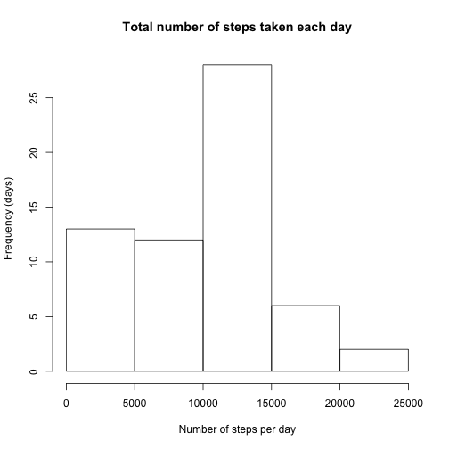
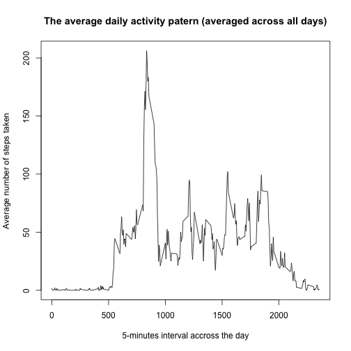
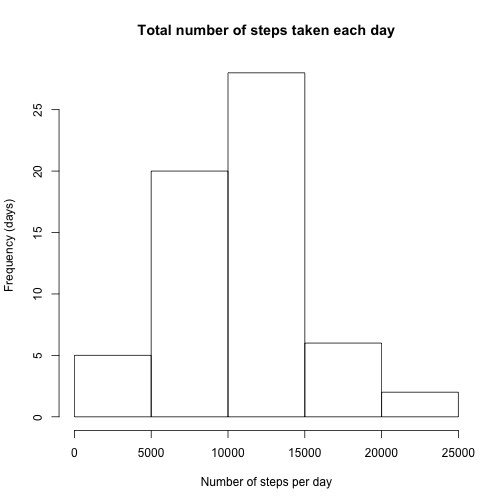
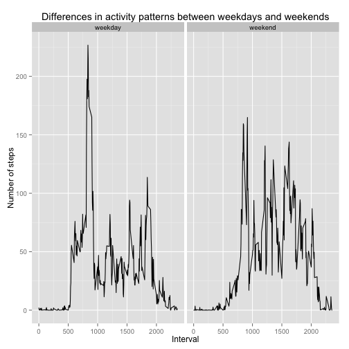

***  

#### Annotation!
*Please note that time is given in 5-minutes interval format.*  
*For example:*

- *0 corresponds to 00:00 in standart hh:mm time format*
- *55 corresponds to 00:05 in standart hh:mm time format*
- *100 corresponds to 01:00 in standart hh:mm time format*
- *2355 corresponds to 23:55 in standart hh:mm time format*

***  

### Loading and preprocessing the data


```r
raw_data <- read.csv("./activity 2.csv", stringsAsFactors = FALSE)
```

### What is mean total number of steps taken per day?
1) Total number of steps taken per day:

```r
total_steps <- sum(raw_data$steps, na.rm = TRUE) / 61
```
Total number of steps taken per day is **9354**  

***  

2) Histogram of the total number of steps taken each day:

```r
steps_day <- summarise(group_by(raw_data, date), sum(steps, na.rm = TRUE))
steps_day <- as.data.frame(steps_day)
hist(steps_day[,2], main = "Total number of steps taken each day", ylab = "Frequency (days)", xlab = "Number of steps per day")
```

 

***  

3) The mean and median of the total number of steps taken per day:

```r
steps_mean <- mean(steps_day[,2])
steps_median <- median(steps_day[,2])
```
The mean of the total number of steps taken per day is **9354**  
The median of the total number of steps taken per day is **10395**  

***  

### The average daily activity pattern  
1) The time series plot:

```r
int_5m <- summarise(group_by(raw_data, interval), mean(steps, na.rm = TRUE))
plot(int_5m, type = "l", xlab = "5-minutes interval accross the day", ylab = "Average number of steps taken", main = "The average daily activity patern (averaged across all days)")
```

 

*** 

2) 5-minute interval which contains maximum number of steps accross all the days in the data set:

```r
max_st <- filter(int_5m, int_5m[,2] == max(int_5m[,2]))
max_st
```

```
## Source: local data frame [1 x 2]
## 
##   interval mean(steps, na.rm = TRUE)
## 1      835                  206.1698
```
You can see from output above that maximum number of steps accross all the days contains interval **835**  - **206** steps.  

***  

### Imputing missing values  
1) The total number of missing values in the dataset:

```r
total_rows <- nrow(raw_data)
miss_val_rows <- nrow(filter(raw_data, complete.cases(raw_data) == FALSE))
```
The total number of rows in the dataset is **17568**  
The total number of rows with missing values is **2304**

***  

2) It was decided to fill missing values by mean of all days for that 5-minutes interval:

```r
steps_inter <- summarise(group_by(raw_data, interval), sum(steps, na.rm = TRUE))
ndays <- nrow(steps_day)
raw_data_no_na <- raw_data

for(i in 1:nrow(raw_data_no_na)) {
        if(is.na(raw_data_no_na[i,1])) {
                interval_with_na <- raw_data_no_na[i,3]
                sum_steps_interval <- filter(steps_inter, steps_inter$interval == interval_with_na)
                mean_interval <- sum_steps_interval[,2] / ndays
                raw_data_no_na[i,1] <- round(mean_interval[1,1], digits = 0)
        }
}
```

***  

3) Histogram of the total number of steps taken each day with filled NAs:

```r
steps_day_filled <- summarise(group_by(raw_data_no_na, date), sum(steps, na.rm = TRUE))
steps_day_filled <- as.data.frame(steps_day_filled)
hist(steps_day_filled[,2], main = "Total number of steps taken each day", ylab = "Frequency (days)", xlab = "Number of steps per day")
```

 

***  

3.1) The mean and median of the total number of days taken per day with filled NAs:

```r
steps_mean_filled <- mean(steps_day_filled[,2])
steps_median_filled <- median(steps_day_filled[,2])
```

- The mean of the total number of steps taken per day with filled NAs is **10581**.  Which is **1226** more than the mean of the total number of steps taken per day without filled NAs (**9354**)
- The median of the total number of steps taken per day with filled NAs is **10395**. Which is equals to the median of the total number of steps taken per day without filled NAs
- Comparing 2 histograms (without filled NAs and with filled NAs) we can find that:

1. Number of days with amount of steps between 0 and 5K is decreased
2. Number of days with amount of steps between 5K and 10K is increased

***  

### Are there differences in activity patterns between weekdays and weekends?  
1) Creating a new variable in the dataset with two levels – “weekday” and “weekend” indicating whether a given date is a weekday or weekend day:

```r
raw_data_no_na$date <- as.Date(raw_data_no_na$date)
raw_data_no_na$days <- as.factor(c("weekday", "weekend"))
for(i in 1:nrow(raw_data_no_na)) {
        if(weekdays(raw_data_no_na[i,2], abbreviate = TRUE) == "Sat" || weekdays(raw_data_no_na[i,2], abbreviate = TRUE) == "Sun") {
                raw_data_no_na[i,4] <- "weekend"
        }
        else {
                raw_data_no_na[i,4] <- "weekday"
        }
}
```

***  

2) Creating a panel plot containing a time series plot of the 5-minute interval (x-axis) and the average number of steps taken, averaged across all weekday days or weekend days (y-axis):

```r
raw_gr_by_weekdays <- summarise(group_by(raw_data_no_na, interval, days), mean(steps))
qplot(interval, `mean(steps)`, data = raw_gr_by_weekdays, facets = . ~ days, geom = "path", main = "Differences in activity patterns between weekdays and weekends", ylab = "Number of steps", xlab = "Interval")
```

 

***
